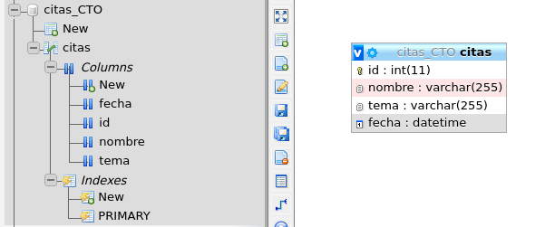
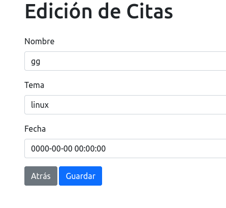
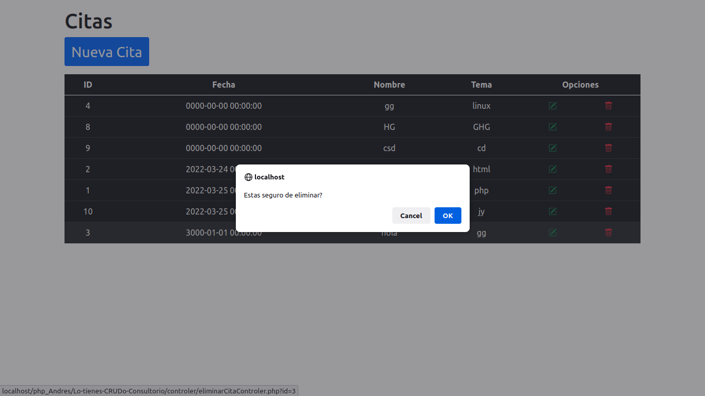

<style>

r { color: red; }
o { color: orange; }
g { color: green; }
blu { color: blue; }
of {color:orange; }
pu {color: purple; }

</style>

<h1 style="color:blue; opacity: 0.8; font-weight:700;font-size:20px">

 Lo tienes CRUDo (Consultorio) 
</h1>


<details  style="color: red">


<summary><blu> Detalles crud php </blu> </summary>

<g>

Desarrollar una aplicación "CRUD" Web en PHP que permita pedir cita a los desarrolladores y equipos para solucionar problemas técnicos con la ayuda del formador o CTO.

<p></p>

<r>

Contexto del proyecto:

</r>

Nos encontramos en una empresa de desarrollo y necesitamos una aplicación que permita pedir cita al CTO para resolver problemas técnicos de los equipos de desarrollo.

De momento vamos a desarrollar un producto mínimo viable (MVP). Una aplicación orientada a objetos usando el patrón MVC (Modelo, Vista, Controlador).


<r>

Requisitos Funcionales:

</r>

La aplicación constará de al menos 3 páginas
Una página para la lista con todas las citas previstas.
Una página con un formulario para crear una nueva cita.
Una página para editar una cita concreta.
Páginas:

<r>

Lista:

</r>

<blu>

Las citas beben aparecer por orden de creación con:

</blu>

<p></p>

- El nombre del coder o del equipo.
- El tema de consulta
- Fecha y hora de la creación de la cita
- Las citas se podrán eliminar.
- Podremos acceder a la edición de cada cita, y a la página de creación de   una cita nueva.

<r>

Crear nueva cita:

</r>

- Formulario con los campos necesarios obligatorios
- Botón para borrar los campos
-Botón para cancelar y volver a la lista principal
-Botón para enviar la información

<r>

Editar cita:

</r>

- Formulario con los campos necesarios obligatorios.
- Los campos deben tener la información de la cita a editar
- Boton cancelar, Botón de enviar
- La aplicación deberá ser responsiva.

<r>

Requisitos Técnicos:

</r>

Aplicación de tipo CRUD (Create, Read, Update, Delete)
Deberá ser Orientada a objetos con el patrón MVC
Deberá estar en un servidor gratuito en producción.
Se debe usar Git con buenas prácticas en los commits.
El repositorio debe contener un Readme con explicación del proyecto, y una explicación de cómo instalar o ejecutar la aplicación.

<r>

Extras:

</r>

- Hacer investigación y documentación de encapsulación, herencia y - polimorfismo.
- Hacer buscador.
- Hacer el front con REACT.

<r>

Tecnologías:

</r>

Frontend: HTML, CSS, SCSS - Opcional: Framework de CSS.
Backend: PHP, PDO.
Bases de datos: MySQL.

<r>

Entrega:

</r>

- Un link a un repositorio de github
- Link a url del proyecto en producción
- Presentación en diapositivas + Link
- Demo y code review
- Semántica HTML
- Buenas Practicas en CSS, SCSS
- Capacidad de Abstración en clases y objetos.
- Buenas prácticas OOP - Encapsulación, Herencia.
- Patrones de diseño - Modelo Vista Controlador (MVC).
- Implementar la aplicación en un servidor en producción.
- Uso de Git.
- Desarrollo basado en historias de usuario y tareas (Kanban) => opcional.
Comunicación y autoevaluación.

<blu>

Modalidades pedagógicas

</blu>

- El desarrollo será en parejas.

<blu>

Modalidades de evaluación

</blu>

- El estilo de la web debe ser novedoso y creativo.

<blu>

Entregables

</blu>

- Repositorio de Github.
- Página en producción.


</g>

# </details>


---
---

##  <of>Data Base Name "Date"</of> 
---



---
---

## <of>Change Date</of>

---




---
---

## <of>Delete Date</of>
---


---
---
<blu>

### Code php:

#

```php

<?php

require './model/conexion.php';

$db = new Database();

$sentencia = $db->mysql->query("select * FROM citas ORDER BY citas.fecha ASC");
$sentencia->execute();
$resultado = $sentencia->fetchAll(PDO::FETCH_ASSOC);

//echo'<pre>';
//print_r($resultado);


require './view/citasView.php';

<?

```

```
<?php
if (!isset($_GET['id'])) {
  header('Location: index.php?mensaje=error');
  exit();
}


require './model/conexion.php';

$db = new Database();

$id = $_GET['id'];

$sentencia = $db->mysql->prepare("select * FROM citas where id = ?;");
$sentencia->execute([$id]);
$citas = $sentencia->fetch(PDO::FETCH_OBJ);
print_r($citas);

require './view/editarView.php';
```

#


### Tools:

</blu>

<pu>

- PHP:
![Php][php]

[php]: https://www.php.net/images/logos/php-icon-black.gif "PHP" 

- HTML:


- CSS:


- JavaScript:


</pu>

<of>

___

### Proyect:

</of>

## [Lo tienes CRUDo (Consultorio) github](https://github.com/JymmyMurillo/Lo-tienes-CRUDo-Consultorio)

___


## [herokuapp](https://lo-tienes-crudo.herokuapp.com/)

<of>

___
_ _ _


###  CODERS:

</of>

&copy; Marzo 27 de 2022

## [Jimmy Murillo](https://github.com/JymmyMurillo)

## [Darío Higuera Moreno](https://github.com/dariohimo)

___

